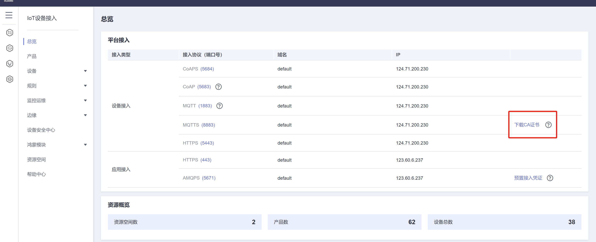

## 下载 AC 证书

在 IoTDA 控制台下载实例的 `mqtts_ca_cert.pem`（或平台提供的根 CA 包）。



## 推荐：使用官方 `ca.jks`（多区域根证书合集）

华为设备 SDK 示例中的 **`ca.jks`**（即 `huaweicloud-iot-root-ca-list.jks`）包含各区域权威根 CA，比只导入单个 `mqtts_ca_cert.pem` 更不易出现 SSL 握手失败。

可从官方 demo 工程复制：

`huaweicloud-iot-device-sdk-java/iot-device-demo/src/main/resources/ca.jks`

```java
IoTDeviceManager.init(
    "ssl://{你的实例ID}.st1.iotda-device.cn-north-4.myhuaweicloud.com:8883",
    "C:/path/to/ca.jks"
);
```

## 备选：自制 JKS（须无密码 + 真 JKS 格式）

SDK 用 **空密码**、**JKS 格式** 加载。常见两个坑：

1. **JDK9+ 默认生成 PKCS12**，扩展名虽叫 `.jks` 但 SDK 读出来 `entries=0` → SSL 握手失败  
2. **PowerShell 里 `-storepass ""` 传参错误**，或旧文件带密码 → `keystore password was incorrect`

### Windows PowerShell（推荐照抄）

```powershell
cd C:\Home\Document\Develop\Java\framework\lab\iotda\src\main\resources

# 必须先删旧文件（可能是 PKCS12 或带密码的 jks）
Remove-Item .\mqtts_ca_cert.jks -Force -ErrorAction SilentlyContinue

$empty = ''
# 若仍弹出「是否信任此证书」，在提示后输入 y 回车（不要用 yes / 是）
"y" | keytool -importcert -alias huawei-iot `
  -file .\mqtts_ca_cert.pem `
  -keystore .\mqtts_ca_cert.jks `
  -storetype JKS `
  -storepass $empty `
  -noprompt

# 验证：至少 1 条，且 magic 为 FE ED FE ED
keytool -list -keystore .\mqtts_ca_cert.jks -storetype JKS -storepass $empty
```

**不要**在 PowerShell 里写 `-storepass ""`（两个引号常被吃掉）；用 `$empty = ''` 再 `-storepass $empty`。

若 PEM 含多段 `BEGIN CERTIFICATE`，`importcert` 只导入第一条；仍失败请用官方 `ca.jks`。

## 使用 PEM 路径

扩展名为 `.pem` / `.crt` 时 SDK 只读取**第一个**证书块；你当前的 `mqtts_ca_cert.pem` 含 2 张证，可能导致：

`SSLHandshakeException: Remote host terminated the handshake`

**建议改用 `.jks`（官方 ca.jks 或上面无密码自制）。**

## 接入地址核对（重要）

- TLS 必须为：`ssl://{控制台设备接入域名}:8883`（不是 `tcp://...:1883`）
- 可用控制台域名，部分环境也可用 IP（如 `ssl://124.71.200.230:8883`）；若仅 IP 握手失败，再换域名试
- 域名须与控制台「设备接入地址」一致（`st1`/`st2`、区域勿写错）
- `Test-NetConnection` 端口通 ≠ TLS 握手成功，握手失败优先查 **CA 信任库**
- `deviceId` / `deviceSecret` 错误通常报认证失败，而非 SSL handshake

## 快速排查清单

| 现象 | 可能原因 | 处理 |
|------|----------|------|
| SSLHandshakeException | 假 JKS（实为 PKCS12）或 entries=0 | 加 `-storetype JKS` 重建 |
| keystore password was incorrect | 旧 jks 未删 / PowerShell 空密码传错 | 先 `Remove-Item`，用 `$empty=''` |
| 同上 | 仅单区域 pem / SDK 只加载 pem 第一条 | 换官方 `ca.jks` |
| 同上 | 接入域名与证书不匹配 | 核对控制台 ssl 地址 |
| connect failed (auth) | 密钥错误 | 检查 deviceSecret |
